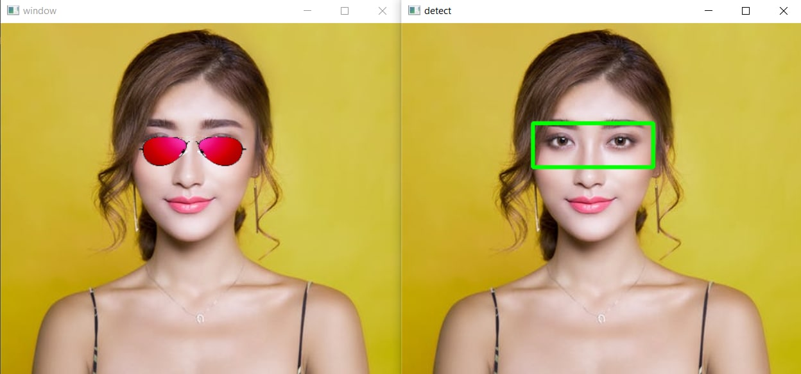
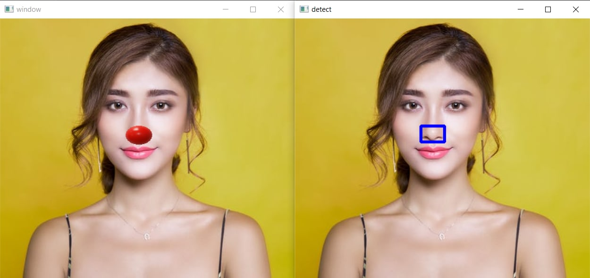
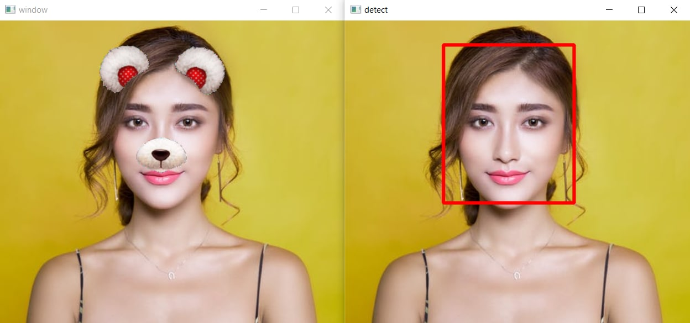
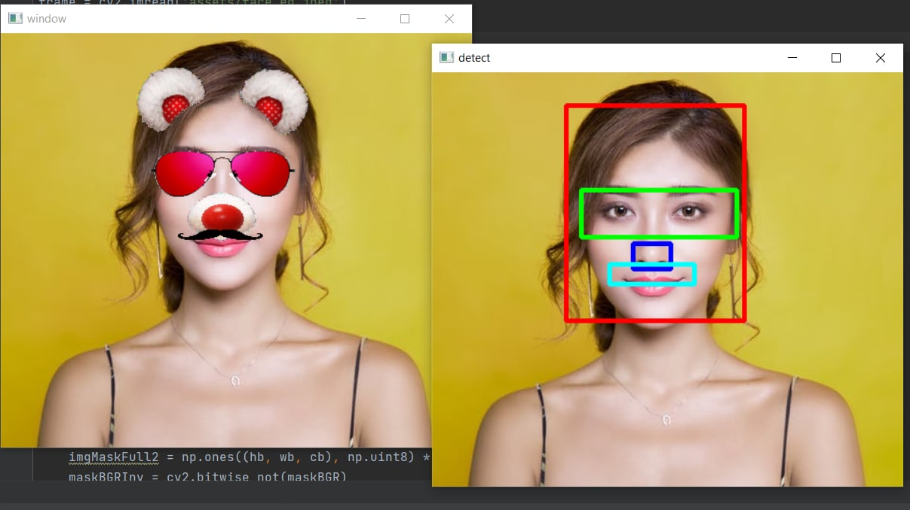
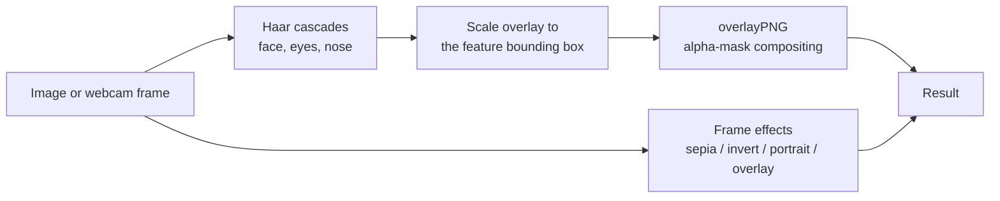

# 😎 Face Filters Using OpenCV

Snapchat-style face filters in a desktop **PyQt5** application. Haar cascades locate the face,
eyes and nose, then transparent PNG overlays — glasses, mustaches, animal noses, whole animal
faces — are alpha-composited onto a still image or a live webcam feed. Full-frame colour effects
are included too.




> Left: the filter applied. Right: the detected eye region the overlay is anchored to.

## Overview

The application is a GUI over a small computer-vision pipeline. Pick filters from four dropdowns,
apply them to an uploaded photo or a live camera feed, and save the result. The interesting part
is not the detection — Haar cascades are well-trodden — but the compositing, which is where a
naive implementation visibly fails.

## Features

### Feature overlays

Anchored to detected facial landmarks, and combinable:

| Slot | Options |
| --- | --- |
| Glasses | `glasses`, `shades`, `sunglasses_1`, `sunglasses_2`, `thug_glasses` |
| Nose | `pig-nose`, `dog-nose`, `cat-nose`, `bear-nose`, `clown-nose` |
| Mustache | `mustache`, `mustache_2`, `mustache_3` |
| Full animal face | `cat`, `dog`, `pig`, `bear` |

| Nose filter | Animal face | Combined |
| --- | --- | --- |
|  |  |  |

### Frame effects

Applied to the whole image rather than the face:

| Effect | Implementation |
| --- | --- |
| Colour overlay | Weighted blend with a solid BGRA layer |
| Sepia | Weighted blend with a sepia-toned layer |
| Invert | Bitwise NOT |
| Portrait | Threshold to a foreground mask, Gaussian-blur the frame, alpha-blend the two so the background softens |

The two categories are mutually exclusive, and the animal-face filter excludes the individual
feature filters — selecting one resets the others, since a full cat face and a separate pair of
glasses would compete for the same pixels.

## How It Works



**1. Detection.** OpenCV's bundled `haarcascade_frontalface_default.xml` and `haarcascade_eye.xml`,
plus a nose cascade, locate the features in each frame.

**2. Scaling.** Overlay size and position are derived from the detected feature's bounding box, so
filters track the face as it moves toward or away from the camera instead of staying a fixed size.

**3. Compositing.** This is the part worth reading. Pasting a PNG rectangle straight onto the
frame brings the PNG's black background with it. `overlayPNG()` instead splits the alpha channel
off the foreground, uses it as a mask to isolate the artwork, uses the *inverted* mask to punch a
matching hole in the background, then ORs the two together — so only the non-transparent pixels
land and the overlay keeps its true shape.

Live mode displays the running FPS.

## Tech Stack

- **Language**: Python
- **Computer Vision**: OpenCV (Haar cascades, alpha compositing)
- **GUI**: PyQt5
- **Numerical**: NumPy

## Repository Structure

```
Face-Filters-Using-OpenCV/
├── src/
│   └── face_filters.py       # PyQt5 GUI, detection, compositing, frame effects
├── assets/                   # transparent PNG overlays, loaded at runtime
├── docs/
│   ├── REPORT.pdf            # full project report
│   ├── PPT.pptx              # project presentation
│   └── images/               # figures used in this README
├── requirements.txt
├── README.md
└── LICENSE
```

## Running the Project

```bash
pip install -r requirements.txt
python src/face_filters.py
```

> **Run from the repository root.** The application loads its overlays with the relative path
> `assets/...`, so the working directory must be the repository root, not `src/`.

> **Required extra file** — the nose overlays need `haarcascade_nose.xml` in the working
> directory. It is not bundled with OpenCV and is not included here; download a nose Haar cascade
> and place it at the repository root. Every other filter works without it.

### Using the GUI

**On an image**

1. **Upload** — choose an image file
2. Select filters from the dropdowns
3. **Apply Filters**
4. **Save** — write the result wherever you like

**On live video**

1. Select filters from the dropdowns
2. **Live** — the webcam opens with the filters applied
3. Press `q` to close the feed

## Dataset

None. Detection uses pretrained Haar cascades and the overlays are hand-assembled PNG artwork in
[`assets/`](assets/).

## Future Scope

- Replace Haar cascades with a landmark model (MediaPipe or dlib) for overlays that follow head
  rotation rather than just position and scale.
- Add filter tracking across frames so overlays stop flickering when detection drops a frame.
- Support recording filtered video, not just stills.

## Acknowledgments

B.Tech project at **Amrita School of Engineering, Bangalore** (Amrita Vishwa Vidyapeetham),
December 2021, supervised by Dr. Suja P., by Vishnu Sainadh Kedarisetty, Satwik Kukkadapu and
Ashrith Vadde.

## Documentation

- 📄 [Project Report](docs/REPORT.pdf)
- 📊 [Presentation](docs/PPT.pptx)
