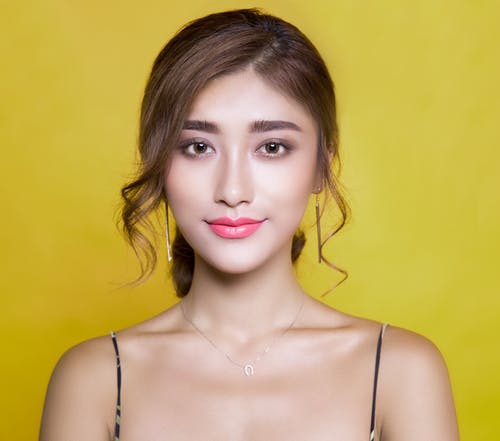

# Face Filters Using OpenCV

Snapchat-style face filters in a desktop **PyQt5** app. Detect the face, eyes and nose with Haar
cascades, then alpha-composite transparent PNG overlays — glasses, mustaches, animal noses, whole
animal faces — onto a still image or a live webcam feed. Full-frame colour effects are included
too.




## What it does

**Feature overlays** — placed on detected facial landmarks, and combinable:

| Slot | Options |
| --- | --- |
| Glasses | `glasses`, `shades`, `sunglasses_1`, `sunglasses_2`, `thug_glasses` |
| Nose | `pig-nose`, `dog-nose`, `cat-nose`, `bear-nose`, `clown-nose` |
| Mustache | `mustache`, `mustache_2`, `mustache_3` |
| Full animal face | `cat`, `dog`, `pig`, `bear` |

**Frame effects** — applied to the whole image instead of the face:

| Effect | Implementation |
| --- | --- |
| Colour overlay | Weighted blend with a solid BGRA layer |
| Sepia | Weighted blend with a sepia-toned layer |
| Invert | Bitwise NOT |
| Portrait | Threshold to a foreground mask, Gaussian-blur the frame, alpha-blend the two so the background softens |

The two categories are mutually exclusive, and the animal-face filter excludes the individual
feature filters — selecting one resets the others, since a full cat face and a separate pair of
glasses would fight over the same pixels.

## How the compositing works

Naive overlay pastes a rectangle and takes the PNG's black background with it. `overlayPNG()`
instead splits the alpha channel off the foreground, uses it as a mask to isolate the artwork,
uses the inverted mask to punch a matching hole in the background, then ORs the two together —
so only the non-transparent pixels land, and the overlay keeps its shape.

Overlay size and position are derived from the detected feature's bounding box, so filters scale
with the face as it moves toward or away from the camera.

Detection uses OpenCV's bundled `haarcascade_frontalface_default.xml` and `haarcascade_eye.xml`,
plus a nose cascade. Live mode displays the running FPS.

## Running it

```bash
pip install opencv-python PyQt5 numpy
python Code.py
```

`Code.py` and the `assets/` folder must be in the same directory.

> **Required extra file** — the nose overlays need `haarcascade_nose.xml` in the working
> directory. It is not bundled with OpenCV and is not in this repo; grab a nose Haar cascade and
> drop it next to `Code.py`. Everything else works without it.

### Using the GUI

**On an image**

1. **Upload** — pick an image file
2. Choose filters from the dropdowns
3. **Apply Filters**
4. **Save** — write the result wherever you like

**On live video**

1. Choose filters from the dropdowns
2. **Live** — the webcam opens with the filters applied
3. Press `q` to close the feed

## Repository layout

```
Code.py       # PyQt5 GUI, Haar cascade detection, overlay compositing, frame effects
assets/       # transparent PNG overlays
REPORT.pdf    # full write-up
PPT.pptx
```

## Team

B.Tech project at **Amrita School of Engineering, Bangalore** (Amrita Vishwa Vidyapeetham),
December 2021, supervised by Dr. Suja P.

- K. Vishnu Sainadh
- K. Satwik
- V. Ashrith
